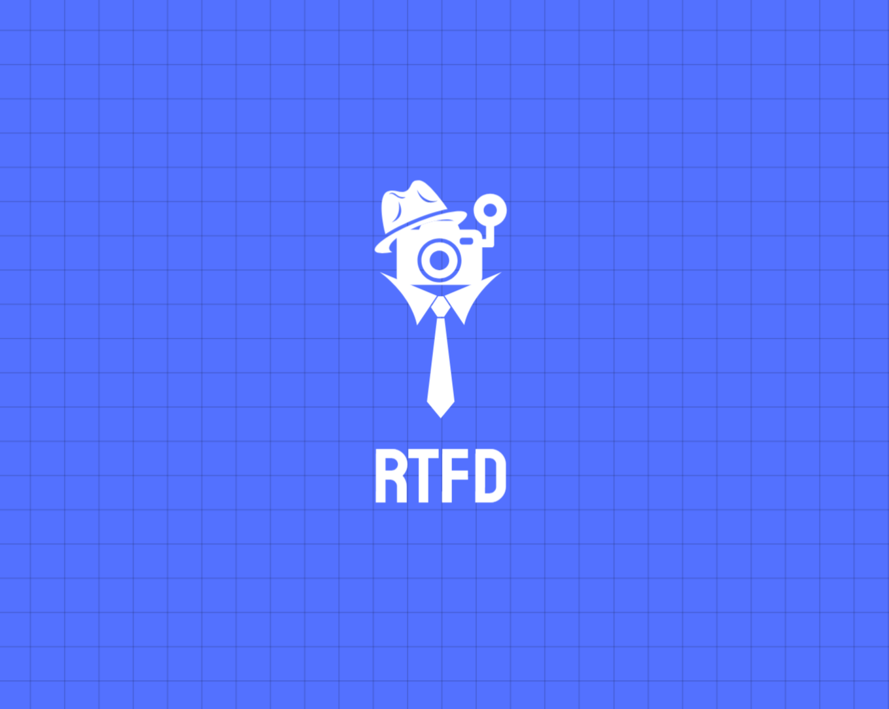
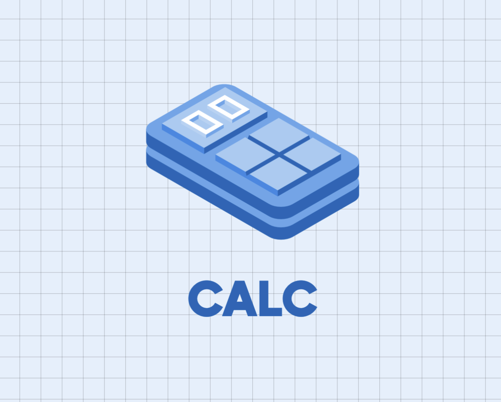
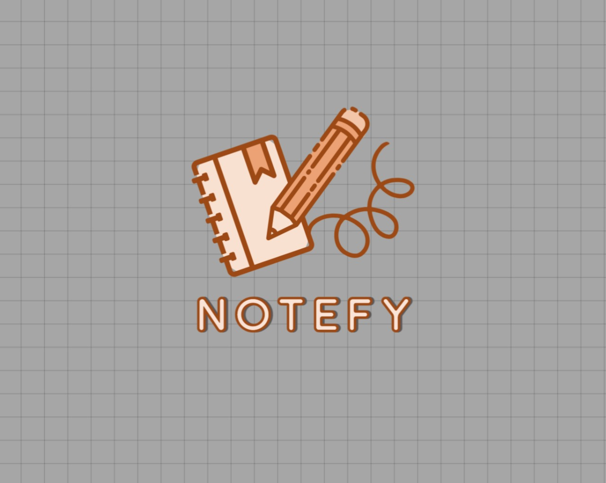

# 
WELCOME TO MY PROFILE

    

HELLO WORLD! WELCOME TO MY GITHUB PROFILE.  I'M <u><b>SUVAJIT KARMAKAR</b></u>. JUST SCROLL THROUGH TO FIND OUT MY LATEST PROJECTS AND CONTRIBUTIONS

## ABOUT ME

DEDICATED PROFESSIONAL WITH A PASSION FOR INNOVATION AND PROBLEM-SOLVING.
EXPERIENCED IN FULL-STACK DEVELOPMENT, ARTIFICIAL INTELLIGENCE - MACHINE LEARNING & DATA ANALYSIS. KEEN AND SEEKING OPPORTUNITIES TO CONTRIBUTE AND GROW IN A DYNAMIC ENVIRONMENT.

- Bsc(H) IN COMPUTER SCIENCE
- MASTERS IN COMPUTER APPLICATION
- 4+ YEARS OF EXPERIENCE IN FULL STACK DEVELOPMENT

## INTERNSHIP
Intern @CodSoft in month of July - BATCH61

## VISIT MY PORTFOLIO WEBSITE
[SUVAJIT-KARMAKAR-PORTFOLIO]('https://suvajit-karmakar-portfolio.vercel.app')

## MY TECHNOLOGY STACK

## PROJECTS

HERE ARE SOME OF THE SIGNIFICANT PROJECTS, FEEL FREE TO HOVER AROUND AND TAKE A LOOK AT THE CODE BASE,  IF MORE <b><i><u>"LET'S COLLABORATE"</u></i><b>

### [RTFD](https://github.com/SUVAJIT-KARMAKAR/REAL-TIME-FACE-DETECTION-SYSTEM)
The real-time face recognition project utilizes OpenCV and machine learning algorithms to detect and recognize faces in real-time. The application is robust and flexible and allows detection and capture of face for real-time attendance system.

### [SAY SOCIAL](https://github.com/SUVAJIT-KARMAKAR/SAY-SOCIAL-TELEGRAM-BOT)
A single yet intriguing bot that will help you in generating your next social-media captions. It uses Google's GeminiAPI / OpenAi API in order to generate the captions and serve to the user.

### [GUESSIT](https://github.com/SUVAJIT-KARMAKAR/GUESS-IT-CLI)
A simple CLI (Command-Line-Interface) application using Rust Programming language that facilitates a simple guessing game.

### [CALC](https://github.com/SUVAJIT-KARMAKAR/CALC)
A simple web-calculator for mobile devices, fully-responsive with proper functionalities and eye-catching digit color separation.

### [NOTEFY]()
A simple end-to-end note application for taking your notes in one go, save it, edit it and make yourself productive than ever before.

> REST OF THE REPOSITORIES ARE YOURS TO EXPLORE !

## 
 LET'S WORK TOGETHER 

I AM ALWAYS UP TO SOMETHING INTERESTING AND EXCITING, 
<u>JUST CLICK THE ICONS & LET'S COLLABORATE</u>

## 
 THANK YOU SO MUCH 

THANK YOU FOR VISITING MY GITHUB PROFILE !  I HOPE YOU FOUND SOMETHING INTERESTING AND AND USEFUL. <u>MAKE SURE YOU FORK IT.</u>   PLEASE DO HIT THE STAR AND HAVE A GREAT DAY
✨🌟
