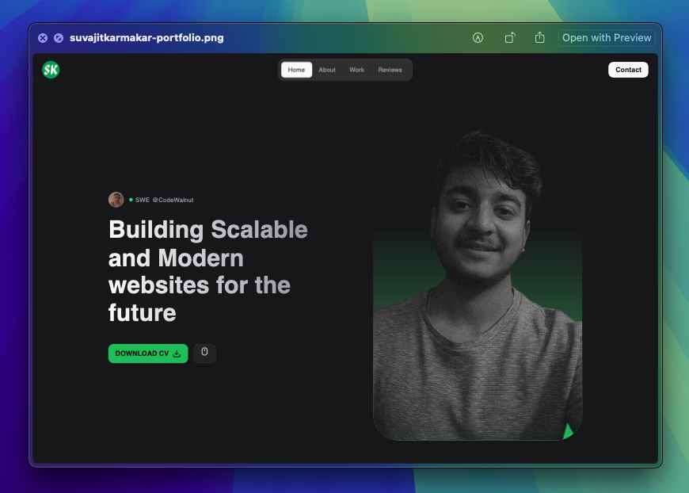

  

# 
&lt;WELCOME TO MY PROFILE/&gt;

HELLO WORLD! WELCOME TO MY GITHUB PROFILE.  I'M <u><b>SUVAJIT KARMAKAR</b></u>

## ABOUT ME

`DEDICATED PROFESSIONAL WITH A PASSION FOR INNOVATION AND PROBLEM-SOLVING.`
 
Experienced in Full-Stack Development ~ Woked closely with ReactJs, NodeJs, ExpressJs, Go and much more.
 
 
KEEN AND SEEKING OPPORTUNITIES TO CONTRIBUTE AND GROW IN A DYNAMIC ENVIRONMENT.

- Bsc(H) IN COMPUTER SCIENCE
- MASTERS IN COMPUTER APPLICATION
- 5+ YEARS OF ACADEMIC EXPERIENCE IN FULL STACK DEVELOPMENT AND COUNTING

## INTERNSHIP
Software Engineer Intern `@CodeWalnut`

## VISIT MY PORTFOLIO WEBSITE

## MY TECHNOLOGY STACK

<table align="center" border="1">
  <tr>
    <td align="center"> </td>
    <td align="center"> </td>
    <td align="center"> </td>
    <td align="center"> </td>
    <td align="center"> </td>
    <td align="center"> </td>
    <td align="center"> </td>
    <td align="center"> </td>
    <td align="center"> </td>
    <td align="center"> </td>
    <td align="center"> </td>
    <td align="center"> </td>
    <td align="center"> </td>
    <td align="center"> </td>
  </tr>
</table>

## 
 LET'S WORK TOGETHER 

<table align="center" border="1">
<tr>
  <td align="center">  
    
  </td>
  <td align="center">
    
  </td>
  <td align="center">
  
  </td>
</tr>
</table>

&lt;THANK YOU SO MUCH/&gt;

  

