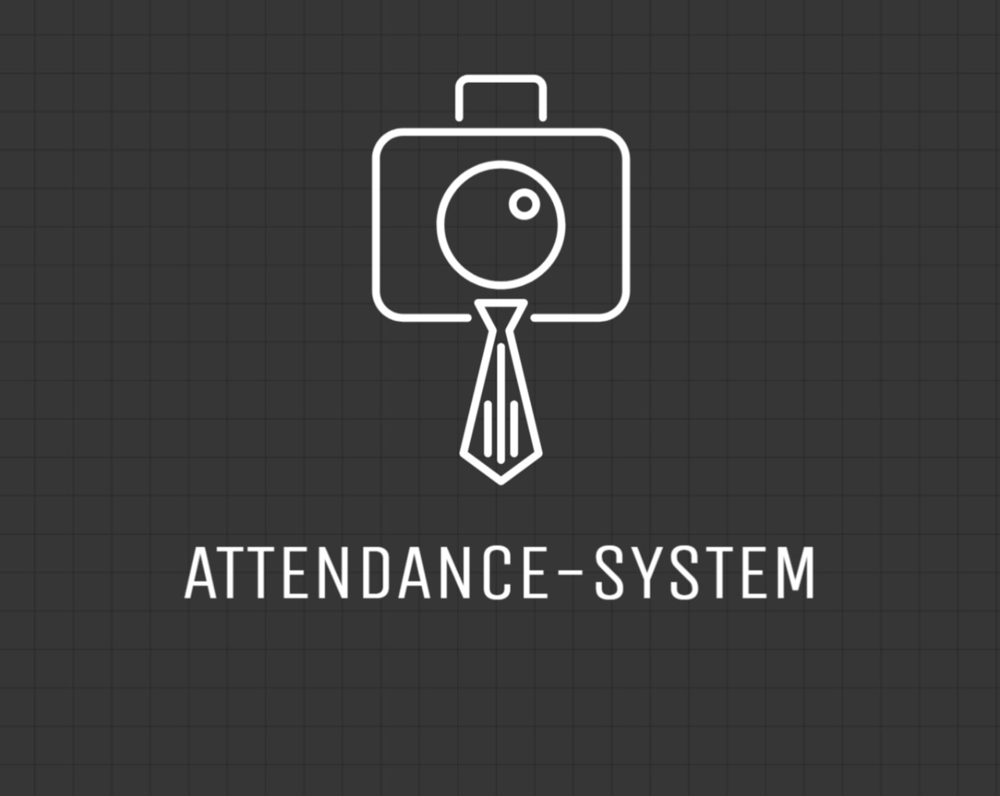
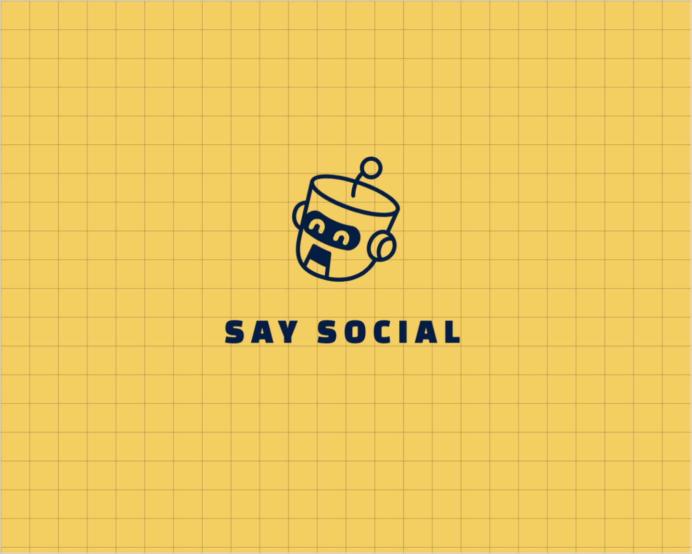
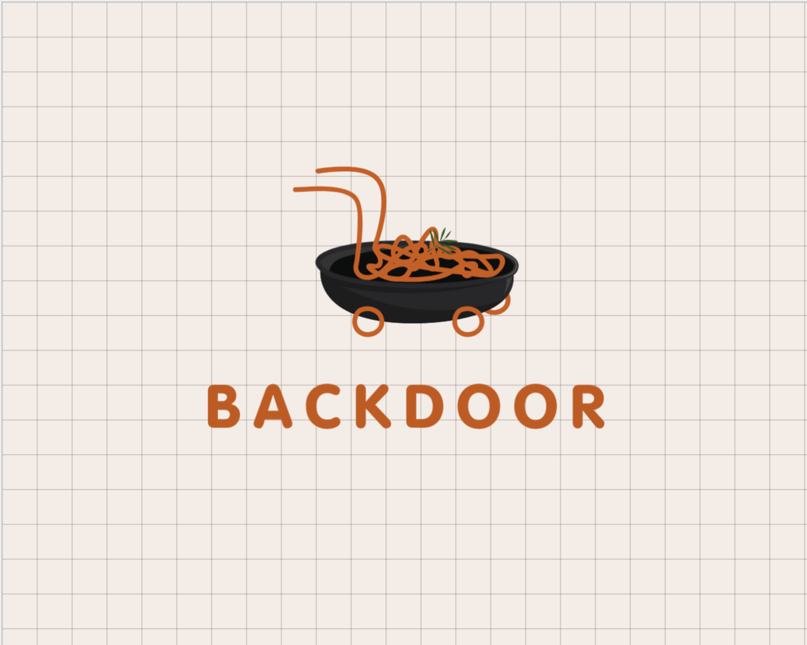
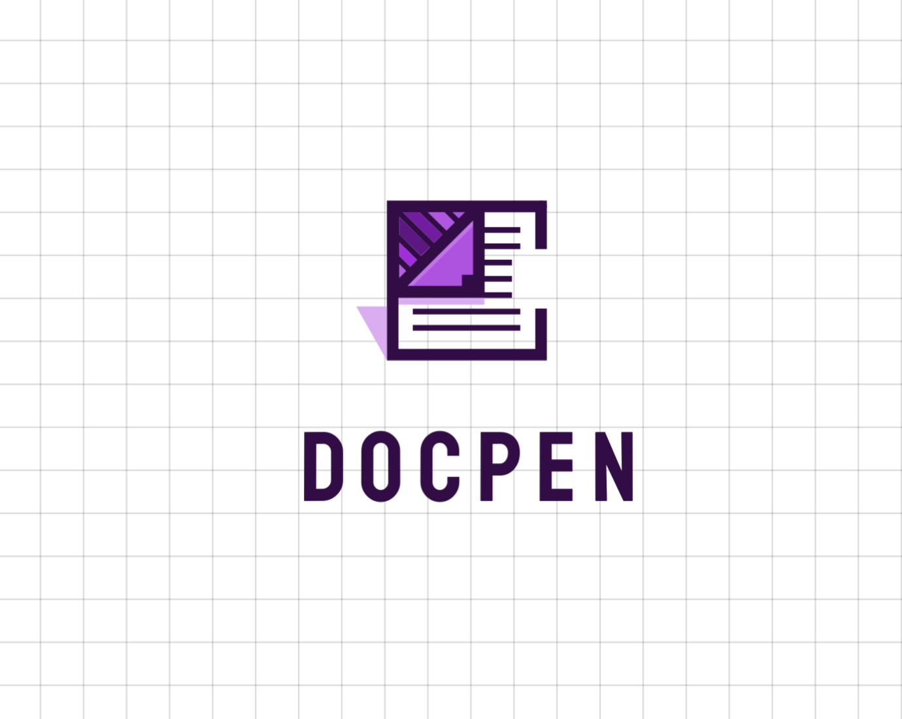

  

# 
&lt;WELCOME TO MY PROFILE/&gt;

HELLO WORLD! WELCOME TO MY GITHUB PROFILE.  I'M <u><b>SUVAJIT KARMAKAR</b></u>. JUST SCROLL THROUGH TO FIND OUT MY LATEST PROJECTS AND CONTRIBUTIONS

## ABOUT ME

DEDICATED PROFESSIONAL WITH A PASSION FOR INNOVATION AND PROBLEM-SOLVING.
EXPERIENCED IN FULL-STACK DEVELOPMENT, ARTIFICIAL INTELLIGENCE - MACHINE LEARNING & DATA ANALYSIS. KEEN AND SEEKING OPPORTUNITIES TO CONTRIBUTE AND GROW IN A DYNAMIC ENVIRONMENT.

- Bsc(H) IN COMPUTER SCIENCE
- MASTERS IN COMPUTER APPLICATION
- 4+ YEARS OF ACADEMIC EXPERIENCE IN FULL STACK DEVELOPMENT

## INTERNSHIP

Software Engineer Intern `@CodeWalnut`

## VISIT MY PORTFOLIO WEBSITE

<a href="https://suvajit-karmakar-portfolio.vercel.app"> `SUVAJIT-KARMAKAR-PORTFOLIO` </a>

## MY TECHNOLOGY STACK

<!--  -->
<!--  -->
<!--  -->
<!--  -->

## PROJECTS

HERE ARE SOME OF THE SIGNIFICANT PROJECTS, FEEL FREE TO HOVER AROUND AND TAKE A LOOK AT THE CODE BASE,  IF MORE <b><i><u>"LET'S COLLABORATE"</u></i><b>

<!-- PROJECT ONE -->

### [RTFD](https://github.com/SUVAJIT-KARMAKAR/RTFD-HACKVISION-24.git)

The real-time face recognition project utilizes OpenCV and machine learning algorithms to detect and recognize faces in real-time. The application is robust and flexible and allows detection and capture of face for real-time attendance system.

<!-- PROJECT TWO -->

### [SAY SOCIAL](https://github.com/SUVAJIT-KARMAKAR/SAY-SOCIAL-TELEGRAM-BOT)

A single yet intriguing bot that will help you in generating your next social-media captions. It uses Google's GeminiAPI / OpenAi API in order to generate the captions and serve to the user.

<!-- PROJECT THREE -->

### [BACKDOOR](https://github.com/SUVAJIT-KARMAKAR/BACKDOOR.git)

From your application to your doorstep, Backdoor has it all covered. A simple, streamlined backend food ordering platfrom which includes admin panel, vendor panel , shops and much more.

<!-- PROJECT FOUR -->

### [DOCPEN](https://github.com/SUVAJIT-KARMAKAR/DOCPEN.git)

A online collaborative text editor platform is designed to facilitate seamless and productive teamwork. Whether you're working on a single document or managing multiple projects, our platform provides a robust environment for real-time collaboration and efficient communication with ease..

> REST OF THE REPOSITORIES ARE YOURS TO EXPLORE !

## 
 &lt;LET'S WORK TOGETHER/&gt; 

I AM ALWAYS UP TO SOMETHING INTERESTING AND EXCITING,
<u>JUST CLICK THE ICONS & LET'S COLLABORATE</u>

 

  
   &nbsp; &nbsp;
   
  &nbsp; &nbsp;
  

 

## 
 &lt;THANK YOU SO MUCH/&gt; 

THANK YOU FOR VISITING MY GITHUB PROFILE !  I HOPE YOU FOUND SOMETHING INTERESTING AND USEFUL.  <u>MAKE SURE YOU FORK IT.</u>   PLEASE DO HIT THE STAR AND HAVE A GREAT DAY
✨🌟

 

  

